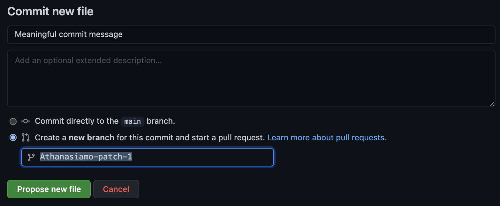

# About 

This repository collects R-Ladies blogs, this is inclusive of those who identify as a minority gender (including but not limited to cis/trans women, trans men, non-binary, genderqueer, & agender). We'd love to have contributions to this list! If you identify with R-Ladies and have a blog, please add yourself.

# Contributing checklist

 - [ ] The entry is added to [blogs/](blogs/) folder
 - [ ] The entry filename ends with `.json`
 - [ ] The json contains at minimum: 
     - [ ] title (blog title)
     - [ ] type ("blog")
     - [ ] url (blog url)
     - [ ] rss_feed (RSS feed for R-related posts. Ideally, you use "tags" or "categories" to identify your R-related posts. A title-based RSS feed is OK. If you need more input on how to get your RSS, have a look [here](https://zapier.com/blog/how-to-find-rss-feed-url/))
     - [ ] photo_url (logo or profile)
     - [ ] language (one of [ISO 639-1 Language Codes](https://www.w3schools.com/tags/ref_language_codes.asp))
     - [ ] authors (list of authors)

# Contributing details

All the blogs are listed in the [blogs](blogs/) folder, where each blog is in its own json-file. These files are used to render a table on the upcoming revamped R-Ladies website. Follow the below instructions to add to the list. If you have any trouble, please create an issue for us to help.

Depending on how you are most comfortable working, there are several ways of adding new entries. 

If you are not familiar with JSON you can [open an issue](https://github.com/rladies/awesome-rladies-blogs/issues/new/choose) with your blog info, which uses a GitHub Form, and we'd create the JSON for you!

Now we will focus on adding new entries directly through GitHub, but you could also work on a local copy (branch) or fork and add new entries that way too.


## Create a new file

Create a new file in the [blogs/](blogs/) folder by [using this link](https://github.com/rladies/awesome-rladies-blogs/new/main/?filename=blogs/your-blog-url.com.json&value=%7B%0A%20%20%22title%22%3A%20%22Your%20title%22%2C%20%2F%2Frequired%0A%20%20%22subtitle%22%3A%20%22subtitle%20or%20tagline%22%2C%20%2F%2Foptional%0A%20%20%22type%22%3A%20%22blog%22%2C%20%2F%2Frequired%0A%20%20%22url%22%3A%20%22https%3A%2F%2Fyour_blog.com%22%2C%20%2F%2Frequired%0A%20%20%22photo_url%22%3A%20%22https%3A%2F%2Fyour_blog.com%2Fyour_photo.png%22%2C%20%2F%2Frequired%0A%20%20%22description%22%3A%20%22Short%20description%20of%20what%20you%20blog%20about%22%2C%0A%20%20%22language%22%3A%20%22en%22%2C%20%2F%2Frequired%0A%20%20%22rss_feed%22%3A%20%22%5Burl%5D%2Ffile.xml%22%20%2F%2Frequired%0A%20%20%22authors%22%3A%20%5B%20%2F%2Frequired%0A%20%20%20%20%7B%0A%20%20%20%20%20%20%22name%22%3A%20%22Your%20Name%22%2C%20%2F%2Frequired%0A%20%20%20%20%20%20%22social_media%22%3A%20%5B%7B%0A%20%20%20%20%20%20%20%20%20%22twitter%22%3A%20%22username%22%2C%0A%20%20%20%20%20%20%20%20%20%22mastodon%22%3A%20%22%40username%40server.org%22%2C%0A%20%20%20%20%20%20%20%20%20%22github%22%3A%20%22username%22%2C%0A%20%20%20%20%20%20%20%20%20%22instagram%22%3A%20%22username%22%2C%0A%20%20%20%20%20%20%20%20%20%22youtube%22%3A%20%22username%2Fend-url%22%2C%0A%20%20%20%20%20%20%20%20%20%22tiktok%22%3A%20%22username%22%2C%0A%20%20%20%20%20%20%20%20%20%22periscope%22%3A%20%22username%22%2C%0A%20%20%20%20%20%20%20%20%20%22researchgate%22%3A%20%22username%22%2C%0A%20%20%20%20%20%20%20%20%20%22website%22%3A%20%22url%22%2C%0A%20%20%20%20%20%20%20%20%20%22linkedin%22%3A%20%22username%22%2C%0A%20%20%20%20%20%20%20%20%20%22facebook%22%3A%20%22username%22%2C%0A%20%20%20%20%20%20%20%20%20%22orcid%22%3A%20%22member%20number%22%2C%0A%20%20%20%20%20%20%20%20%20%22meetup%22%3A%20%22end-url%22%0A%20%20%20%20%20%20%7D%5D%0A%20%20%20%20%7D%0A%20%20%5D%0A%7D).
This link will fork the repository to your user account, and initiate a new file with some template content in it.

### File name

The name of the file should be the site url (without `www` or `http(s)://` . This way we can ensure each file has a unique name and that duplication does not happen.

### File content

Using the link above will create a template for you to start with.
Fill inn all the information that is relevant for your blog.
There are several adaptations to an entry you can make that are not highlighted in every entry.
Remove all mentions of `\\required`, these are just for making it clear which information you _must_ provide for the file to be valid.
Any optional field you don't want to add, you may delete entirely.
For instance, if you don't have a subtitle or tagline for your blog, remove the entire line of `"subtite": "subtitle or tagline"` rather than leaving it empty with `"subtite": ""`

#### Photo

The photo url you provide will be displayed as your blogs thumbnail. 
This may be a picture of you, or if you have a logo for your blog/website, it may be best to use this in stead.

#### Authors

The entry may have several authors. This is for blogs where maybe there are several blogging together. If it is a blog that mainly has guest bloggers, its better to list the editors/maintainers of the blog and add "guest bloggers" as authors also.

Adding several authors means duplicating the content between the curlies `{}` in the author section, and adding a comma between each one.

```json
"authors": [
  {
    "name": "Athanasia Mo  Mowinckel",
    "social_media": [{
      "twitter": "DrMowinckels",
      "github": "Athanasiamo"
    }]
  },
  {
    "name": "Mary Johnson",
    "social_media": [{
      "linkedin": "maryj",
      "youtube": "maryj"
    }]
  },
  {
    "name": "Guest bloggers"
  }
]
```

#### Icons

The `social_media` section supports many different key-value pairs. 
For rendering on the website, only the three first social media items for each author will be rendered.

```json
"twitter": "username"
"mastodon": "@username@instance"
"github": "username"
"instagram": "username"
"youtube": "username/end-url"
"tiktok": "username"
"periscope": "username"
"researchgate": "username"
"website": "url"
"linkedin": "username"
"facebook": "username"
"orcid": "member number"
"meetup": "end-url"
```

#### Language
The language field should be populated with the [ISO 639-1 Language Codes](https://www.w3schools.com/tags/ref_language_codes.asp) of the site content.
Please be thorough when entering this information.

## Commit and PR the file

At the bottom of the page on GitHub, add a commit message in the box. 



You will immediately be sent to the 'Pull requests' page, to create a PR to the main branch. 
Click the `Create pull request` button.
Once this is done, a new page will open and some automated checks of your submitted entries start. 
In the comment section, make sure to @drmowinckels so she can take a look.

If anything needs fixing you will be notified and given instructions on how to do that.

Once all checks pass and the entries have been reviewed, they will be merged to the main branch.
